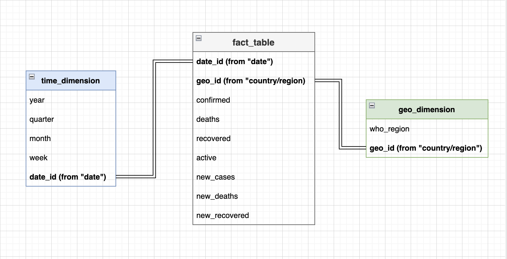

# N5 Challenge

### Initial Set Up

Here are some notes on how I completed the N5 Challenge. Since I'm a Mac user I had to do some things differently:

- [x] Got the dataset from: https://www.kaggle.com/datasets/imdevskp/corona-virus-report.
- [x] Set up Apache Spark Cluster with Docker, including: JupyterLab, Spark Driver Web UI, a Master node and 2 Worker nodes. You can check this set up on the `docker-compose.yml` file I got from [this repository](https://github.com/cluster-apps-on-docker/spark-standalone-cluster-on-docker).

### Generation of `parquet` files

Using the Jupyter Notebook, I was able to solve all parts of the challenge except for the DER diagram, all details are in the notebook, the file is called `data_processing.ipynb`.

### DER diagram

About the DER diagram, it didn't make sense to me to do it, because these datasets are not necessary related in any fashion, they're just different ways to report with different geographic levels, but there are no ways to join them to create a more complete report from what I saw. So, just to make something here, I wanted to put myself in the case where I wanted to take one of these datasets (`full_grouped.csv`) and make a star-schema of it, which is powerful for analytics.

I'll take a sample with snake_case column names for clarity:

|date      |country/region|confirmed|deaths|recovered|active|new_cases|new_deaths|new_recovered|who_region           |
|----------|--------------|---------|------|---------|------|---------|----------|-------------|---------------------|
|2020-01-22|Afghanistan   |0        |0     |0        |0     |0        |0         |0            |Eastern Mediterranean|
|2020-01-22|Albania       |0        |0     |0        |0     |0        |0         |0            |Europe               |
|2020-01-22|Algeria       |0        |0     |0        |0     |0        |0         |0            |Africa               |
|2020-01-22|Andorra       |0        |0     |0        |0     |0        |0         |0            |Europe               |
|2020-01-22|Angola        |0        |0     |0        |0     |0        |0         |0            |Africa               |

From here we can see we have the following elements on the dataset:

* **Time Dimension**: Given by `date`, daily granularity. We can extend this dimension to build a useful hierarchy.
* **Geographic Dimensions**: Given by `who_region` and `country/region`. Since each element in `country/region` must belong to a parent in `who_region`, we can easily build a hierarchy with geographic levels.
* **Measures**: Each one of the remaining columns represent a measure on the dataset, these can be aggregated through drilldowns and cuts on the time and geographic dimensions available.

After wrangling this specific dataset, the star-schema would look like this:

